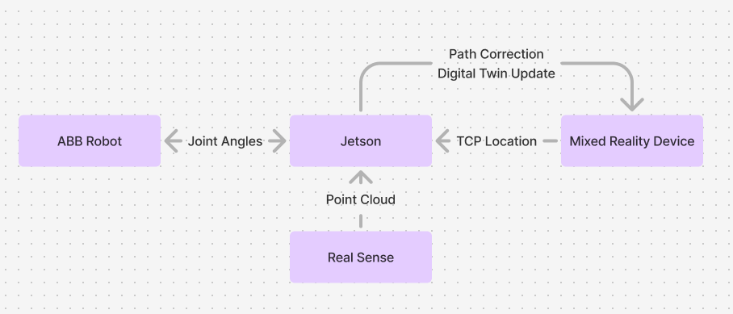

# Mixed Reality Integration in 6DoF Collaborative Robotic Systems

**Miles Popiela**  
VCU  
11-1-2024

## 1.1 Background

Robotic systems have become integral to modern society, operating in manufacturing facilities, warehouses, and increasingly in service-oriented environments. As robotics technology continues to advance, we stand at the threshold of a significant transformation where robots will transition from industrial settings into everyday environments. However, this transition presents a fundamental challenge: the current paradigm requires specialized technical knowledge for safe and effective robot operation, creating a barrier between this powerful technology and its potential everyday users.

The complexity of modern robotic systems, particularly those with six degrees of freedom (6DoF), typically demands extensive training in robotics principles, programming, and safety protocols. This technical barrier contradicts the growing need for accessible robotic solutions that can be utilized by individuals without specialized engineering backgrounds. While standardization and automation have made certain robotic applications more accessible, these approaches often constrain users to predetermined operational patterns, limiting the expression of individual creativity and problem-solving approaches.

## 1.2 Problem Statement

The fundamental challenge lies in bridging the gap between complex robotic capabilities and everyday users while preserving human individuality in robot operation. Current interfaces and control systems typically follow one of two extremes: they either require extensive technical expertise or offer oversimplified, rigid interaction patterns that restrict user creativity. This dichotomy has created a significant barrier to the widespread adoption of robotics in personal and small business applications, where adaptability and individual expression are crucial.

## 1.3 Research Objective

This research aims to evaluate and optimize mixed reality workspace configurations for 6DoF robotic systems, comparing basic and advanced setups to determine their relative efficiency, reliability, and usability. By conducting a systematic analysis of different hardware configurations—from simple TCP coordination to comprehensive Isaac simulation integration—we seek to establish quantitative and qualitative metrics for workspace performance. The study will examine factors including setup complexity, system latency, spatial accuracy, and user adaptation across various mixed reality devices and environmental conditions. This research will provide empirical data to guide the implementation of mixed reality interfaces in robotic applications, with particular attention to the trade-offs between system complexity and operational effectiveness.

Key investigative areas include:

- Comparative analysis of basic TCP-based setups versus advanced Isaac simulation configurations
- Performance evaluation across different mixed reality devices and their integration requirements
- Assessment of point cloud data collection methods and their impact on system accuracy
- Measurement of system response times and precision under various operational conditions
- Evaluation of workspace scalability and adaptability to different industrial environments

## 2. Methodology

### 2.1 Experimental Design

This study employs a mixed-methods approach combining quantitative performance metrics with qualitative user experience assessment. The experimental design incorporates controlled testing of both basic and advanced workspace configurations across multiple trials and participants.

### 2.2 System Configuration Analysis

The analysis encompasses two primary configurations:

Basic Configuration Testing:
- Implementation of a direct TCP coordination system
- Measurement of baseline performance metrics

Advanced Configuration Testing:
- Integration of Isaac simulation environment
- Evaluation of Jetson processing unit performance
- Analysis of RealSense camera point cloud accuracy

### 2.3 Performance Metrics

Key quantitative measurements include:
- System latency between input command and robot response
- Spatial accuracy in TCP positioning
- Processing overhead for both configurations
- Point cloud data quality and refresh rate
- Path execution precision
- Setup and calibration time requirements

### 2.4 LERP Control Analysis

Distance-based linear interpolation testing:
- Measurement of response curves at varying distances
- Analysis of movement precision vs. distance relationship
- Evaluation of gesture recognition accuracy
- Documentation of speed-scaling effectiveness

### 2.5 Cross-Platform Evaluation

Testing across different mixed reality devices:
- Comparative analysis of consumer mobile devices vs. dedicated headsets
- Assessment of device-specific latency and accuracy
- Documentation of setup requirements for each platform
- Evaluation of user interface consistency across devices

### 2.6 Data Collection and Analysis

The study will employ:
- Automated performance logging systems
- User interaction recordings
- Structured feedback sessions
- Statistical analysis of quantitative metrics
- Qualitative coding of user experience data

### 2.7 Validation Procedures

Implementation of:
- Cross-validation of measurement systems
- Error margin calculations
- Statistical significance testing
- Repeatability assessments
- System calibration verification

## 3. Workspace Setup

### 3.1 Basic Setup

The basic workspace configuration establishes a direct communication pathway between a mixed reality device and an ABB robot through TCP (Tool Center Point) coordination. The mixed reality device provides hand position (or device position if using a smartphone) input that defines the digital TCP location, which is then overlaid onto the physical TCP. The ABB robot processes this positional data through its inverse kinematics solver to execute the corresponding movements. This setup utilizes path construction playback and editing functions however, it does not implement a digital twin and does not provide object collision.

### 3.2 Advanced Setup

The advanced configuration implements Nvidia's Isaac simulation environment to enhance the system's capabilities. This setup introduces several key components working in concert:

The system architecture consists of:
- A Mixed Reality Device that transmits TCP location data and displays a digital twin
- A Jetson processing unit that serves as the central coordination hub
- A RealSense camera that generates point cloud data of the workspace
- An ABB Robot that receives and executes movement commands

The primary advancement in this configuration is the external processing of inverse kinematics through Isaac simulation, replacing ABB's internal IK solver. Instead of sending TCP locations directly to the robot, the system now communicates joint angles, with Isaac Sim handling the inverse kinematics calculations based on comprehensive workspace point cloud data. This approach enables more sophisticated path correction and digital twin updating capabilities.

## 4. Mixed Reality Interface Design

### 4.1 Mixed Reality Devices

The study employs a diverse range of mixed reality devices to accommodate varying levels of technological accessibility and user preferences:

Consumer Mobile Devices:
- iOS devices with LiDAR capabilities
- Android devices with depth-sensing capabilities
- XREAL glass attachments for smartphone integration

Dedicated Mixed Reality Headsets:
- Apple Vision Pro
- Meta Quest 3
- Microsoft HoloLens 2

This multi-platform approach enables investigation of accessibility across different price points and technological capabilities, providing insights into the democratization of robotic control interfaces.

### 4.2 External Environmental Point Cloud Collection

Utilizing depth cameras such as Intel D445 RealSense cameras we can enhance our environmental understanding by defining unseen areas that our mixed reality device doesn't pick up we can also create a boolean substitution method by layering a digital twin of our robot on top of our point cloud to classify our robot as a robot and not a collision object.

### 4.3 Mixed Reality Interface Control

Here in mixed reality interface control we take an approach to the hand gestures where lerp controls are dialed in by a slider and distance from the robot itself. The goal is to study the effect on lerp control based on distance where the closer your hand is to the TCP the more responsive the robot moves while the further you go from the robot the slower the robot moves however more exaggerated movements speed up the robot's movement.

A simple record and playback system has been developed so that paths and animations can be visualized and editable through mixed reality controls.

## 5. Technical Implementation

[Section to be completed]

## 6. Industrial Applications

[Section to be completed]

## 7. Safety and Reliability

### 7.1 Collision Avoidance (Isaac Sim)

[Section to be completed]

### 7.2 System Redundancy and Fail-Safes

[Section to be completed]

## 8. Future Developments

### 8.1 MagnaForma

[Section to be completed]

### 8.2 Robot Character Overlay for Approachable Robotics

[Section to be completed]

## 9. Conclusion

### 9.1 Key Findings

[Section to be completed]

### 9.2 Recommendations

[Section to be completed]

## References

P. Milgram and F. Kishino, "A taxonomy of mixed reality visual displays," IEICE TRANSACTIONS on Information and Systems, vol. E77-D, no. 12, pp. 1321-1329, 1994.

M.A. Goodrich and A.C. Schultz, "Human-robot interaction: A survey," Foundations and Trends® in Human-Computer Interaction, vol. 1, no. 3, pp. 203-275, 2008.

H. Fang, S.K. Ong, and A.Y.C. Nee, "Robot Programming Using Augmented Reality," in International Conference on CyberWorlds, 2012, pp. 13-20.

W. Hoenig, C. Milanes, L. Scaria, T. Phan, M. Bolas, and N. Ayanian, "Mixed reality for robotics," in IEEE/RSJ International Conference on Intelligent Robots and Systems (IROS), 2015, pp. 5382-5387.

M. Ostanin and A. Klimchik, "Interactive robot programming using mixed reality," IFAC-PapersOnLine, vol. 51, no. 22, pp. 50-55, 2018.

A. Burghardt, D. Szybicki, P. Gierlak, K. Kurc, P. Pietruś, and R. Cygan, "Programming of Industrial Robots Using Virtual Reality and Digital Twins," Applied Sciences, vol. 10, no. 2, p. 486, 2020.

H. Chen, "Motion Control of Interactive Robotic Arms Based on Mixed Reality Development," in IEEE International Conference on Robotics and Automation (ICRA), 2022.